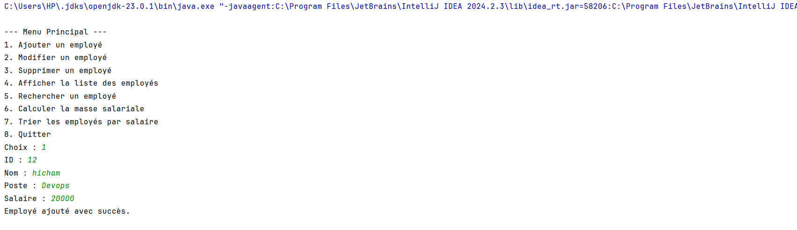

# Projet : Application de Gestion des Employés

Une application pour gérer les employés d’une entreprise. Ce projet utilise les concepts de la **programmation orientée objet (POO)**, avec une structure claire et un code facilement maintenable.

---

## Objectifs de l'application

1. **Ajouter un employé**  
   Créer un nouvel objet `Employe` et l’ajouter au tableau.  
   

2. **Modifier un employé**  
   Mettre à jour les informations d’un employé existant à l’aide de son **identifiant unique**.  
   

3. **Supprimer un employé**  
   Retirer un employé du tableau grâce à son **identifiant unique**.  
   

4. **Afficher la liste des employés**  
   Afficher tous les employés avec leurs détails.  
   

5. **Rechercher un employé**  
   Trouver un employé par son **nom** ou son **poste**.  
   

6. **Calculer la masse salariale**  
   Calculer la somme totale des **salaires mensuels** des employés.  
   

7. **Trier les employés**  
   Afficher les employés triés par **salaire** (ordre croissant ou décroissant).  
   

---

## Technologies utilisées

- **Langage** : Java
- **Paradigme** : Programmation orientée objet (POO)

---

## Organisation du code

- **Classe Employe** : Contient les attributs et méthodes liés à un employé (nom, poste, salaire, etc.).
- **GestionEmployes** : Contient les opérations CRUD et les calculs pour gérer les employés.

---

